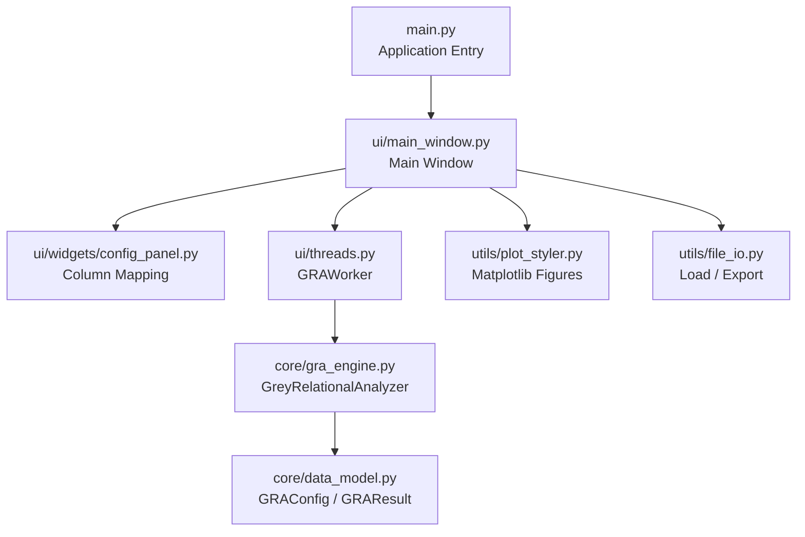

# GRA-MicroAnalyzer

<div align="center">

**Grey Relational Analysis for Microstructural Attribution**
*面向材料科学研究者的灰色关联分析桌面工具*

[](https://python.org)
[](https://doc.qt.io/qtforpython/)
[](#许可声明--license)
[](https://github.com/psf/black)

</div>

---

## 项目简介 | Overview

**GRA-MicroAnalyzer** 是一款面向材料科学研究者的桌面应用程序，用于量化**宏观性能指标**（如抗拉应变、裂缝宽度、强度等）与**微观结构因素**（如结合水含量、孔隙特征、物相组成等）之间的关联强度。

本工具基于灰色关联分析（Grey Relational Analysis, GRA），适合材料试验中常见的**小样本、指标多、信息不完备**场景，可将因素筛选从经验判断转化为可复现的数学计算流程。

---

## 数学原理 | Mathematical Foundation

### 1. 极差归一化

对于序列 $x_i(k)$，根据指标属性选择归一化策略。

**望大型 Larger-the-Better, LTB**

```math
x_i^*(k)=\frac{x_i(k)-\min x_i(k)}{\max x_i(k)-\min x_i(k)}
```

**望小型 Smaller-the-Better, STB**

```math
x_i^*(k)=\frac{\max x_i(k)-x_i(k)}{\max x_i(k)-\min x_i(k)}
```

### 2. 绝对差序列

```math
\Delta_i(k)=\left|x_0^*(k)-x_i^*(k)\right|
```

### 3. 灰色关联系数

```math
\xi_i(k)=\frac{\Delta_{\min}+\rho\Delta_{\max}}{\Delta_i(k)+\rho\Delta_{\max}}
```

其中 $\rho \in (0,1]$，默认 $\rho=0.5$。

### 4. 灰色关联度 GRG

```math
\Gamma_i=\frac{1}{n}\sum_{k=1}^{n}\xi_i(k)
```

$\Gamma_i$ 越接近 1，说明该因素与参考序列的变化趋势越接近，关联程度越强。

---

## 软件架构 | Architecture



---

## 主要功能 | Features

- CSV / Excel 数据导入。
- 自动识别数值兼容列，减少误选文本列导致的计算失败。
- 参考序列与比较序列分别设置 LTB / STB 极性。
- 自动处理缺失值与非数值内容。
- 常量参考列报错，常量比较因素自动剔除。
- 输出 GRG 排名、归一化矩阵、Delta 矩阵、Xi 系数矩阵。
- 生成柱状图、热图、网络图、雷达图。
- 大规模热图自动跳过渲染，避免 GUI 卡死，完整矩阵仍可导出 Excel。
- 雷达图默认限制展示样本数量，避免图形不可读。
- Excel、SVG、PDF、PNG 导出。

---

## 快速开始 | Quick Start

### 1. 安装运行环境

```bash
git clone git@github.com:liqinglq666/GRA_micro_analyzer.git
cd GRA_micro_analyzer
python -m venv .venv
```

Windows:

```bash
.venv\Scripts\activate
```

macOS / Linux:

```bash
source .venv/bin/activate
```

安装依赖：

```bash
pip install -r requirements.txt
```

### 2. 启动 GUI

```bash
python main.py
```

---

## 测试 | Tests

开发环境安装：

```bash
pip install -r requirements-dev.txt
```

运行核心引擎测试：

```bash
pytest
```

测试覆盖内容包括：

- 基础 GRA 排名。
- 非数值数据清洗。
- 常量比较因素自动剔除。
- 常量参考序列报错。

---

## 数据格式建议 | Input Format

建议数据表第一行为列名，例如：

| Sample | Tensile strain | Bound water | Porosity | Crack width |
|---|---:|---:|---:|---:|
| M1 | 2.5 | 0.18 | 12.1 | 58 |
| M2 | 3.1 | 0.21 | 10.8 | 42 |

使用建议：

- `Sample` 作为 ID 列。
- `Tensile strain` 或其他宏观性能作为 Reference Column。
- 微观结构指标作为 Comparative Factors。
- 对“越大越好”的指标选择 LTB。
- 对“越小越好”的指标选择 STB。

---

## 许可声明 | License

本项目面向学术研究与教学使用。若用于商业软件、工程咨询或第三方交付，请先取得作者授权。
