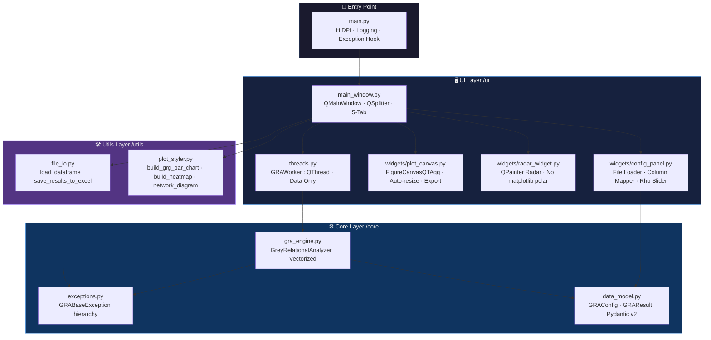
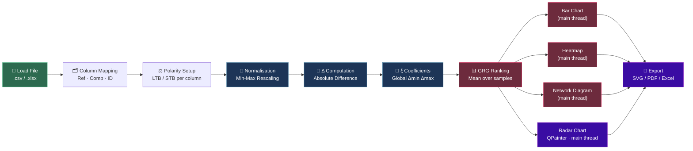
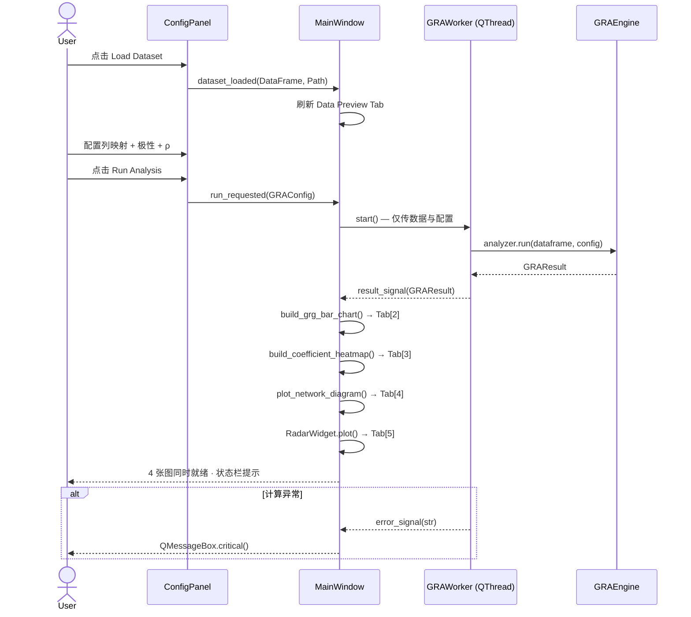

# GRA-MicroAnalyzer

<div align="center">

**Grey Relational Analysis for Microstructural Attribution**
*面向材料科学研究者的灰色关联分析桌面工具*

[](https://python.org)
[](https://doc.qt.io/qtforpython/)
[](#-许可声明--license)
[](https://github.com/psf/black)
[](https://mypy-lang.org/)

</div>

---

## 📖 项目简介 | Overview

**GRA-MicroAnalyzer** 是一款面向材料科学研究者的桌面应用程序，专为量化**宏观性能指标**（如抗拉应变、裂缝宽度）与**微观结构因素**（如结合水含量、孔隙分布）之间的关联强度而设计。

本工具基于邓聚龙教授提出的**灰色关联分析理论（Grey Relational Analysis, GRA）**，能够在小样本、信息不完备的工程场景下，精准识别材料劣化的主控因素，为配合比优化与性能调控提供量化依据。

> **核心价值：** 将传统上依赖研究者经验判断的"因素筛选"环节，转化为可复现、可溯源的数学计算流程，输出结果直接符合 SCI 期刊图表规范。

---

## 🔬 数学原理 | Mathematical Foundation

### 1. 数据预处理：极差归一化

对于序列 $\{x_i(k)\}$，根据指标属性选择归一化策略：

**望大型 (Larger-the-Better, LTB)**

$$x_i^*(k) = \frac{x_i(k) - \min_i x_i(k)}{\max_i x_i(k) - \min_i x_i(k)}$$

**望小型 (Smaller-the-Better, STB)**

$$x_i^*(k) = \frac{\max_i x_i(k) - x_i(k)}{\max_i x_i(k) - \min_i x_i(k)}$$

其中 $x_i^*(k) \in [0, 1]$，$k$ 为样本编号，$i$ 为因素编号。

### 2. 绝对差序列

设参考序列为 $x_0^*(k)$，比较序列为 $x_i^*(k)$，则绝对差为：

$$\Delta_i(k) = \left| x_0^*(k) - x_i^*(k) \right|$$

### 3. 灰色关联系数

$$\xi_i(k) = \frac{\Delta_{\min} + \rho \cdot \Delta_{\max}}{\Delta_i(k) + \rho \cdot \Delta_{\max}}$$

| 符号 | 含义 |
|---|---|
| $\Delta_{\min} = \min_i \min_k \Delta_i(k)$ | 全局最小绝对差 |
| $\Delta_{\max} = \max_i \max_k \Delta_i(k)$ | 全局最大绝对差 |
| $\rho \in (0, 1]$ | 分辨系数（默认 $\rho = 0.5$），用户可调 |

### 4. 灰色关联度（GRG）

对关联系数在样本维度取均值，得到各因素的最终得分：

$$\Gamma_i = \frac{1}{n} \sum_{k=1}^{n} \xi_i(k), \quad \Gamma_i \in (0, 1]$$

$\Gamma_i$ 越接近 1，表明第 $i$ 个微观因素与参考序列的关联程度越强，即对宏观性能的影响越显著。

---

## 🏗️ 软件架构 | Architecture

### 模块依赖图



### 计算与绘图流水线



### 信号-槽通信拓扑



---

## 📁 目录结构 | Directory Structure

```text
gra_micro_analyzer/
│
├── main.py                          # 应用入口：日志 · HiDPI · 全局异常钩子
│
├── core/                            # 纯 Python 业务逻辑，无 Qt 依赖
│   ├── __init__.py
│   ├── exceptions.py                # 7 级自定义异常：GRABaseException → ...
│   ├── data_model.py                # Pydantic v2 冻结模型：GRAConfig · GRAResult
│   └── gra_engine.py                # 全向量化 GRA 引擎：零 for-loop · Broadcasting
│
├── ui/                              # PySide6 表现层，不含业务逻辑
│   ├── __init__.py
│   ├── main_window.py               # 主窗口：5-Tab · 主线程绘图 · 导出工具栏
│   ├── threads.py                   # GRAWorker(QThread)：仅计算数据，不创建 Figure
│   └── widgets/
│       ├── __init__.py
│       ├── config_panel.py          # 动态列映射面板：无 Plot Type 选择器
│       ├── plot_canvas.py           # 自适应画布：随窗口缩放自动重绘
│       └── radar_widget.py          # QPainter 雷达图：不依赖 matplotlib polar axes
│
└── utils/                           # 无状态工具函数
    ├── __init__.py
    ├── file_io.py                   # Pathlib I/O · 多编码 CSV · 5-Sheet Excel 导出
    └── plot_styler.py               # SCI 图表：GRG 柱图 · ξ 热图 · 拓扑网络图
```

---

## ⚡ 快速开始 | Quick Start

### 环境要求

| 依赖 | 版本 | 用途 |
|---|---|---|
| Python | ≥ 3.10 | f-string · match · ParamSpec |
| PySide6 | ≥ 6.6 | GUI 框架 |
| Pandas | ≥ 2.0 | 数据处理 |
| NumPy | ≥ 1.26 | 向量化计算 |
| Matplotlib | ≥ 3.8 | 柱图 · 热图 · 网络图渲染 |
| Pydantic | ≥ 2.5 | 数据模型与校验 |
| networkx | ≥ 3.2 | 拓扑网络图布局 |
| openpyxl | ≥ 3.1 | Excel 读写 |

### 安装与启动

```bash
# Step 1 — 克隆仓库
git clone https://github.com/your-org/gra-micro-analyzer.git
cd gra-micro-analyzer

# Step 2 — 创建隔离虚拟环境（推荐）
python -m venv .venv
source .venv/bin/activate        # Windows: .venv\Scripts\activate

# Step 3 — 安装依赖
pip install -r requirements.txt

# Step 4 — 启动应用
python main.py
```

---

## 🎯 使用流程 | Workflow

**① 导入数据集**
点击 `Load Dataset`，选择 `.csv` 或 `.xlsx` 文件。右侧 **[1] Data Preview** Tab 实时渲染原始表格（最多预览 1 000 行，全量数据参与计算）。

**② 列映射配置**
- `Sample ID Column`：指定样品标签列（用于坐标轴与图例标注）
- `Reference Column (Target)`：选择一个宏观性能指标列（如 `Compressive_Stress_pct`），并设置其极性
- **Comparative Factor Polarities 表格**：为每一个微观因素独立设置极性（`Larger is Better` / `Smaller is Better`）

**③ 参数调节**
拖动 `ρ (Distinguishing Coefficient)` 滑块（范围 0.01–1.0，默认 0.5）以控制分辨率。

**④ 执行分析**
点击 `>> Run Analysis`。计算在后台 `QThread` 中执行，主界面全程不阻塞。完成后 **4 张图表同时就绪**，自动切换到 GRG Results Tab。

**⑤ 查看四种可视化结果**

| Tab | 内容 |
|---|---|
| **[2] GRG Results** | 因子关联度水平柱状图，含 GRG 数值标注 |
| **[3] Coefficient Heatmap** | ξ(k) 系数矩阵热图，支持单元格悬浮提示 |
| **[4] Network Diagram** | 拓扑网络图，边宽与颜色映射 GRG 强度 |
| **[5] Radar Chart** | 雷达蜘蛛图，QPainter 绘制，永远居中显示 |

**⑥ 结果导出**
每个图表 Tab 底部均有独立导出工具栏：
- **Results to Excel (.xlsx)**：导出含 5 个 Sheet 的完整 Excel 工作簿
- **Save Chart / Heatmap / Network / Radar (SVG / PDF)**：导出向量图，符合 SCI 期刊投稿要求

---

## 📊 Excel 导出结构 | Excel Export

每次导出生成一个包含 5 个 Sheet 的 Excel 工作簿：

| Sheet 名称 | 内容说明 |
|---|---|
| `GRG Ranking` | 因子按 GRG 值降序排列，含排名、GRG 值、百分位 |
| `Normalised Sequences` | x* 归一化矩阵，值域 [0, 1] |
| `Delta Matrix` | Δ 绝对差矩阵 |
| `Xi Coefficient Matrix` | ξ(k) 关联系数矩阵 |
| `Analysis Config` | 本次分析全部参数：参考列、ρ 值、各因子极性 |

所有列宽自动适配内容，数值保留 6 位小数。

---

## 📐 输入数据格式 | Input Format

软件自动检测数值列，**不对列名做任何假设**，适配任意字段命名规范：

```
Mix_ID | Tensile_Strain_pct | Max_Crack_Width_um | Wn_pct | CaCO3_pct | Harmful_Pore_pct
-------|--------------------|--------------------|--------|-----------|------------------
FSC    | 7.28               | 148.4              | 14.25  | 11.24     | 12.0
M10    | 6.91               | 162.3              | 15.10  | 10.87     | 14.5
M20    | 6.03               | 197.1              | 16.88  | 9.23      | 18.3
```

- **ID 列**：任意字符串类型
- **数值列**：自动检测，支持 `int` / `float`，忽略全空列
- **最小样本量**：≥ 2 行（行数不足时引擎抛出 `InsufficientDataError`）

---

## 🔧 关键工程决策 | Key Engineering Decisions

### 雷达图：QPainter 替代 matplotlib polar axes

matplotlib 的 `polar=True` 坐标轴在以下场景会出现圆心偏移 bug：Figure 在后台线程创建后传递到主线程渲染时，renderer 上下文不一致，导致极坐标轴圆心漂移至左上角，只显示右下四分之一。

**解决方案**：`radar_widget.py` 完全放弃 matplotlib polar，改用 **QPainter 纯手绘**：
- `cx / cy` 在每次 `paintEvent` 中从 widget 实际宽高实时计算，物理上不可能偏移
- 窗口缩放时 `resizeEvent` 自动触发重绘，始终自适应
- 支持 SVG / PNG 导出

### 所有图表在主线程绘制

`GRAWorker` 线程**只负责计算**，不创建任何 `Figure` 或 `Canvas` 对象。计算完成后通过 `result_signal(GRAResult)` 将结果传回主线程，由 `_on_result_received` 依次调用各绘图函数。这是根治跨线程 Figure 传递问题的架构级解决方案。

### 自适应图表画布

`PlotCanvas` 使用 `Expanding` 尺寸策略，直接填充右侧可用区域。`resizeEvent` 监听窗口大小变化并触发重绘，图表始终充满显示区域，无固定像素约束。

---

## 🛡️ 工程质量 | Engineering Standards

| 规则 | 实现位置 | 说明 |
|---|---|---|
| 零行循环 | `core/gra_engine.py` | 全部使用 Pandas broadcasting，禁止 `iterrows` |
| 不可变数据流 | `core/data_model.py` | `GRAConfig` 与 `GRAResult` 均为 `frozen=True` |
| 非阻塞 UI | `ui/threads.py` | GRA 计算全部在 `QThread` 内执行，不传递 Figure |
| 无硬编码列名 | `ui/widgets/config_panel.py` | 列名完全由运行时 DataFrame 头部驱动 |
| 纯 Pathlib | `utils/file_io.py` | 禁止使用 `os.path`，全面采用 `pathlib.Path` |
| 异常隔离 | `ui/threads.py` | `GRABaseException` → WARNING；未知 `Exception` → ERROR + traceback |
| 线程安全绘图 | `ui/main_window.py` | 所有 Figure / Canvas / QPainter 仅在主线程创建 |

---

## ⚠️ 许可声明 | License

**本项目仅供学术交流使用，不开源，不授予任何商业使用权利。**

未经作者明确书面授权，禁止将本项目的代码、图表生成逻辑或任何衍生内容用于商业产品、商业服务或商业出版物。

如本工具对您的研究有所帮助，欢迎在论文中注明：

```
本研究使用 GRA-MicroAnalyzer 工具进行灰色关联分析。
作者：李庆，中山大学（Sun Yat-sen University），2026。
```

如需合作或引用授权，请联系作者：**liqinglq666@gmail.com**

---

<div align="center">

*Author: 李庆 (Li Qing) · Sun Yat-sen University · liqinglq666@gmail.com · 2026*

*理论源于邓聚龙教授的灰色系统理论（1982），工具服务于每一位严谨的材料研究者。*

</div>
