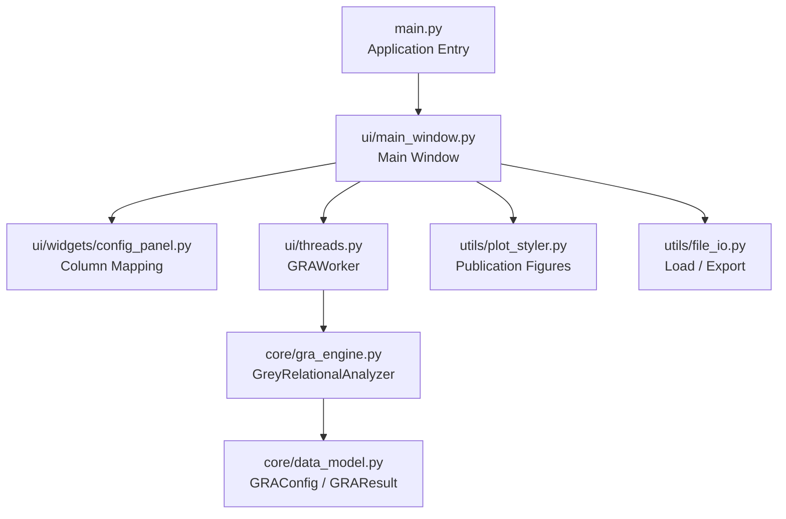

# GRA-MicroAnalyzer

<div align="center">

**Grey Relational Analysis for Microstructure–Property Association**  
*面向材料科学研究者的灰色关联分析桌面工具*

[](https://python.org)
[](https://doc.qt.io/qtforpython/)
[](#许可声明--license)

</div>

---

## 项目简介 | Overview

**GRA-MicroAnalyzer** 用于量化宏观性能指标（抗拉应变、强度、裂缝宽度等）与微观结构因素（孔隙、结合水、物相组成等）之间的灰色关联强度。

本工具面向材料试验常见的**小样本、多指标、信息不完备**场景，提供从数据检查、极性设置、灰色关联计算，到论文图和 Excel 审计输出的一体化工作流。

> **Scientific scope:** GRA measures similarity/association between sequence patterns. A high GRG does **not** by itself prove causality or physical mechanism. Mechanistic interpretation should be supported by experiments, theory, microscopy, spectroscopy, or other independent evidence.

---

## 数学原理 | Mathematical Foundation

### 1. 极差归一化

**望大型 Larger-the-Better, LTB**

```math
x_i^*(k)=\frac{x_i(k)-\min x_i(k)}{\max x_i(k)-\min x_i(k)}
```

**望小型 Smaller-the-Better, STB**

```math
x_i^*(k)=\frac{\max x_i(k)-x_i(k)}{\max x_i(k)-\min x_i(k)}
```

### 2. 绝对差序列

```math
\Delta_i(k)=\left|x_0^*(k)-x_i^*(k)\right|
```

### 3. 灰色关联系数

```math
\xi_i(k)=\frac{\Delta_{\min}+\rho\Delta_{\max}}{\Delta_i(k)+\rho\Delta_{\max}}
```

其中 $\rho \in (0,1]$，默认 $\rho=0.5$。

### 4. 灰色关联度 GRG

```math
\Gamma_i=\frac{1}{n}\sum_{k=1}^{n}\xi_i(k)
```

$\Gamma_i$ 越接近 1，说明该因素与参考序列的变化趋势越接近，关联程度越强。

---

## 软件架构 | Architecture


```mermaid
graph TB
    MAIN[main.py\nApplication Entry] --> MW[ui/main_window.py\nMain Window]
    MW --> CP[ui/widgets/config_panel.py\nColumn Mapping]
    MW --> TH[ui/threads.py\nGRAWorker]
    TH --> GE[core/gra_engine.py\nGreyRelationalAnalyzer]
    GE --> DM[core/data_model.py\nGRAConfig / GRAResult]
    MW --> PS[utils/plot_styler.py\nPublication Figures]
    MW --> FI[utils/file_io.py\nLoad / Export]
```

---

## 主要功能 | Features

- CSV / Excel 数据导入。
- 自动识别可靠数值列：至少 3 个有限数值，且有效率不低于 80%。
- 参考序列与比较序列分别设置 LTB / STB 极性。
- **比较因素逐项勾选**，避免无关数值列被自动纳入。
- 自动处理缺失值、非数值内容以及 `+Inf/-Inf`。
- 任一计算阶段若产生 NaN/Inf，立即停止，避免静默偏差。
- 常量参考列报错，常量比较因素自动剔除并记录。
- 输出 GRG 排名、归一化矩阵、Delta 矩阵、Xi 系数矩阵。
- 并列 GRG 使用相同竞争名次（例如 1, 1, 3）。
- Excel 包含 **Data Quality** 审计表。
- 图形包括：GRG 排名、灰色关联系数热图、关联网络、归一化样本轮廓图。
- GitHub Actions 在 Python 3.10 / 3.12 自动运行源码编译与测试。

---

## 论文级图表输出 | Publication Figures

v1.1 起，所有图统一使用同一套 Matplotlib 论文排版体系：

- Serif / Times New Roman 优先，STIX / DejaVu Serif 回退。
- PDF 使用可嵌入 TrueType 字体，SVG 保留文本对象。
- **SVG / PDF：矢量输出**，优先用于论文排版。
- **PNG：600 dpi**，适合必须提交栅格图的场景。
- 默认双栏宽度约 180 mm，图中文字按论文尺寸缩放。
- GRG 柱状图固定使用理论尺度 `0–1`，避免自动缩放夸大差异。
- 网络图线宽按**绝对 GRG** 映射，不再根据当前数据的 min/max 拉伸。
- 网络布局采用确定性环形结构，相同数据重复绘图不会随机漂移。
- 热图在矩阵较小时显示单元格数值；矩阵较大时自动取消格内数字，只保留色阶，降低视觉拥挤。
- 热图使用感知更均匀的 `cividis` 色阶。
- 雷达/样本轮廓图已统一到 Matplotlib，并支持 SVG / PDF / PNG。

建议论文排版优先导出 `SVG` 或 `PDF`；只有目标期刊明确要求位图时，再使用 `PNG 600 dpi`。

---

## 快速开始 | Quick Start

```bash
git clone git@github.com:liqinglq666/GRA_micro_analyzer.git
cd GRA_micro_analyzer
python -m venv .venv
```

Windows:

```bash
.venv\Scripts\activate
```

macOS / Linux:

```bash
source .venv/bin/activate
```

安装依赖并启动：

```bash
pip install -r requirements.txt
python main.py
```

---

## 测试 | Tests

```bash
pip install -r requirements-dev.txt
python -m pytest
```

当前测试覆盖：

- 手工计算与 GRA 系数 / GRG 对照。
- LTB / STB 归一化。
- 非数值、缺失值、`+Inf/-Inf` 清洗。
- 常量因素、缺失 ID、重复表头。
- ρ 边界值。
- 并列 GRG 排名。
- Excel Data Quality 输出。
- 论文字体和导出设置。
- 固定 GRG 坐标范围。
- 大热图自动取消单元格标注。
- 网络图绝对线宽映射。
- SVG / PDF / PNG 图形导出。

---

## 数据格式建议 | Input Format

| Sample | Tensile strain | Bound water | Porosity | Crack width |
|---|---:|---:|---:|---:|
| M1 | 2.5 | 0.18 | 12.1 | 58 |
| M2 | 3.1 | 0.21 | 10.8 | 42 |

使用建议：

- `Sample` 作为 ID 列。
- 宏观性能指标作为 Reference Column。
- 只勾选具有明确研究意义的 Comparative Factors。
- 对“越大越好”的指标选择 LTB，对“越小越好”的指标选择 STB。
- 如果 Data Quality 显示大量样本被删除，应先处理数据完整性，再解释 GRG 排名。
- 小于 5 个完整样本时软件会给出稳定性警告，结果仅建议用于探索性分析。

---

## 许可声明 | License

本项目面向学术研究与教学使用。若用于商业软件、工程咨询或第三方交付，请先取得作者授权。
